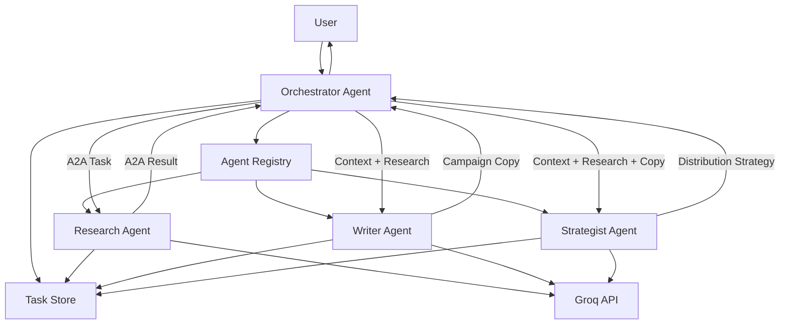

# A2A Multi-Agent Marketing System

> A complete Agent-to-Agent (A2A) communication system built with Python, FastAPI, Groq, Pydantic, asynchronous task processing, agent discovery, structured context sharing, and specialized collaborating agents.

---

## Table of Contents

* [Overview](#overview)
* [Project Goals](#project-goals)
* [Architecture](#architecture)
* [How A2A Works](#how-a2a-works)
* [Agents](#agents)
* [A2A Protocol](#a2a-protocol)
* [Message Structure](#message-structure)
* [Agent Discovery](#agent-discovery)
* [Task Delegation](#task-delegation)
* [Context Sharing](#context-sharing)
* [Async Processing](#async-processing)
* [Example Workflow](#example-workflow)
* [Project Structure](#project-structure)
* [Requirements](#requirements)
* [Installation](#installation)
* [Windows PowerShell Setup](#windows-powershell-setup)
* [Environment Variables](#environment-variables)
* [Run the Application](#run-the-application)
* [API Documentation](#api-documentation)
* [API Endpoints](#api-endpoints)
* [Run the Demo](#run-the-demo)
* [Custom A2A Task](#custom-a2a-task)
* [Testing](#testing)
* [Docker](#docker)
* [GitHub Setup](#github-setup)
* [Render Deployment](#render-deployment)
* [Supabase Production Architecture](#supabase-production-architecture)
* [Production Considerations](#production-considerations)
* [Troubleshooting](#troubleshooting)
* [Future Improvements](#future-improvements)
* [License](#license)

---

# Overview

This project demonstrates a multi-agent AI architecture in which several specialized AI agents communicate with one another through a structured Agent-to-Agent (A2A) protocol.

Instead of asking one large language model to perform every part of a complex task, the system uses an **Orchestrator Agent** that delegates specialized subtasks to independent Worker Agents.

The example application creates a complete marketing campaign for an eco-friendly product.

The system contains four agents:

```text
                         USER
                           |
                           v
                 +-------------------+
                 |   ORCHESTRATOR    |
                 |      AGENT        |
                 +---------+---------+
                           |
              +------------+------------+
              |            |            |
              v            v            v
        +-----------+ +-----------+ +-------------+
        | RESEARCH  | |  WRITER   | | STRATEGIST  |
        |   AGENT   | |   AGENT   | |    AGENT    |
        +-----------+ +-----------+ +-------------+
```

The agents communicate using structured JSON messages containing:

* Task IDs
* Parent task IDs
* Agent IDs
* Target agent IDs
* Conversation history
* Shared state
* Metadata
* Payloads
* Status information

---

# Project Goals

This project satisfies the following requirements:

* OpenAI-compatible Groq API integration
* Multiple collaborating agents
* Orchestrator/worker architecture
* Agent discovery
* Capability registration
* Task delegation
* Structured JSON message passing
* Shared context
* Conversation history
* Shared state
* Task metadata
* Parent/child task relationships
* Asynchronous task execution
* Task status tracking
* Error handling
* FastAPI REST API
* Automated tests
* Docker support
* Render deployment configuration
* GitHub-ready repository structure

---

# Architecture

## High-Level Architecture



---

# How A2A Differs From a Single-Agent Architecture

A traditional single-agent architecture might look like:

```text
User
 |
 v
LLM
 |
 v
Final Answer
```

The model is responsible for:

* Research
* Planning
* Writing
* Strategy
* Decision making
* Final response generation

This can work for small tasks, but becomes difficult to maintain as complexity increases.

An A2A architecture separates responsibilities:

```text
                       Orchestrator
                            |
            +---------------+---------------+
            |               |               |
            v               v               v
        Research          Writer        Strategist
```

Each agent has a specialized role.

Advantages include:

### Specialization

Each worker can be optimized for a specific capability.

### Separation of Concerns

Research logic is separated from copywriting and strategy.

### Scalability

Individual agents can eventually run as independent services.

### Reusability

A Research Agent can be reused by many different orchestrators.

### Observability

Every child task can have its own:

* Task ID
* Status
* Events
* Result
* Error

### Distributed Execution

Agents can eventually live on separate machines or services.

---

# Agents

## Orchestrator Agent

Agent ID:

```text
orchestrator-1
```

Responsibilities:

1. Receive the user request.
2. Discover available agents.
3. Identify required capabilities.
4. Break the task into subtasks.
5. Delegate subtasks.
6. Pass context to workers.
7. Monitor task status.
8. Collect results.
9. Update shared state.
10. Produce the final result.

---

## Research Agent

Agent ID:

```text
research-1
```

Capability:

```text
market_research
```

Responsibilities:

* Market analysis
* Customer analysis
* Competitor analysis
* Positioning
* Differentiation
* Risks

---

## Writer Agent

Agent ID:

```text
writer-1
```

Capability:

```text
campaign_writing
```

Responsibilities:

* Campaign concept
* Taglines
* Landing-page copy
* Social media posts
* Email copy
* Calls to action
* Video concepts

---

## Strategist Agent

Agent ID:

```text
strategist-1
```

Capability:

```text
distribution_strategy
```

Responsibilities:

* Marketing channels
* Paid media
* Organic media
* Influencer strategy
* Launch plan
* KPIs
* Testing strategy

---

# A2A Protocol

The core A2A implementation is located in:

```text
app/a2a_protocol.py
```

The protocol defines:

```text
AgentCard
AgentCapability
A2AMessage
AgentContext
ConversationMessage
TaskRecord
TaskEvent
TaskStatus
AgentRegistry
TaskStore
```

---

# Agent Cards

Every agent advertises its capabilities through an Agent Card.

Example:

```json
{
  "agent_id": "research-1",
  "name": "Research Agent",
  "description": "Researches markets and competitors",
  "endpoint": "/a2a/agents/research-1/tasks",
  "capabilities": [
    {
      "name": "market_research",
      "description": "Analyze markets and competitors",
      "input_types": [
        "marketing_task"
      ],
      "output_types": [
        "research_report"
      ]
    }
  ],
  "version": "1.0.0",
  "active": true
}
```

This allows the orchestrator to understand what a worker can do without knowing its internal implementation.

---

# Agent Discovery

Agents register themselves with:

```http
POST /a2a/agents/register
```

The registry stores the Agent Card.

To list all agents:

```http
GET /a2a/agents
```

To retrieve a specific agent:

```http
GET /a2a/agents/{agent_id}
```

To search for a capability:

```http
GET /a2a/discover/{capability}
```

For example:

```http
GET /a2a/discover/market_research
```

The response identifies agents capable of performing market research.

---

# Step-by-Step Agent Discovery

The discovery process is:

```text
1. Agent starts
       |
       v
2. Agent creates AgentCard
       |
       v
3. Agent registers with registry
       |
       v
4. Registry stores capabilities
       |
       v
5. Orchestrator queries registry
       |
       v
6. Orchestrator finds required capability
       |
       v
7. Orchestrator delegates task
```

For example:

```text
Orchestrator
     |
     | "Who can perform market_research?"
     |
     v
Agent Registry
     |
     | "research-1"
     v
Research Agent
```

---

# Message Structure

Every A2A message uses a structured JSON schema.

Example:

```json
{
  "task_id": "8a1f9f7d-3d4e-4f44-b4d0-123456789abc",
  "parent_task": null,
  "agent_id": "orchestrator-1",
  "target_agent_id": "research-1",
  "context": {
    "conversation_history": [],
    "shared_state": {},
    "metadata": {
      "priority": "high",
      "deadline": "2026-12-31",
      "source": "demo",
      "tags": [
        "marketing",
        "eco"
      ]
    }
  },
  "payload": {
    "instruction": "Research the market",
    "product": "Reusable biodegradable cleaner"
  },
  "message_type": "task",
  "created_at": "2026-09-01T00:00:00Z"
}
```

---

# Context Sharing

The context structure contains three major components.

## 1. Conversation History

Conversation history records messages and agent outputs.

Example:

```json
{
  "role": "user",
  "agent_id": null,
  "content": "Create a marketing campaign"
}
```

An agent result can be added as:

```json
{
  "role": "agent_result",
  "agent_id": "research-1",
  "content": "Market research..."
}
```

---

## 2. Shared State

Shared state allows information generated by one worker to become available to other workers.

Initially:

```json
{
  "shared_state": {}
}
```

After Research:

```json
{
  "shared_state": {
    "research": {
      "report": "..."
    }
  }
}
```

After Writer:

```json
{
  "shared_state": {
    "research": {
      "report": "..."
    },
    "campaign_copy": {
      "copy": "..."
    }
  }
}
```

After Strategist:

```json
{
  "shared_state": {
    "research": {},
    "campaign_copy": {},
    "strategy": {}
  }
}
```

---

## 3. Metadata

Metadata contains workflow-level information.

Example:

```json
{
  "priority": "high",
  "deadline": "2026-12-31",
  "source": "demo",
  "tags": [
    "marketing",
    "eco"
  ]
}
```

This can later be extended with:

* User ID
* Tenant ID
* Authentication information
* Request origin
* Cost limits
* Token limits
* Model preferences
* Retry count

---

# Parent and Child Tasks

The orchestrator creates a parent task:

```text
Task A
```

It then creates child tasks:

```text
Task A
 |
 +-- Research Task
 |
 +-- Writer Task
 |
 +-- Strategy Task
```

The child task stores:

```json
{
  "parent_task": "Task-A"
}
```

This allows workflows to be traced.

---

# Task Lifecycle

Every task can have one of four states:

```text
SUBMITTED
    |
    v
WORKING
    |
    +----------+
    |          |
    v          v
COMPLETED    FAILED
```

The lifecycle is:

```text
Client
  |
  | POST task
  v
API
  |
  | 202 Accepted
  v
Background task
  |
  v
Worker
  |
  v
Completed / Failed
```

---

# Async Processing

The API does not need to wait for every LLM call.

When a task is submitted:

```http
POST /a2a/orchestrate
```

the server responds:

```http
202 Accepted
```

Example:

```json
{
  "task_id": "123",
  "status": "submitted",
  "message": "Orchestration task accepted.",
  "status_url": "/a2a/tasks/123"
}
```

The client can then query:

```http
GET /a2a/tasks/123
```

---

# Task Events

Each task stores events.

Example:

```json
{
  "task_id": "123",
  "events": [
    {
      "status": "working",
      "agent_id": "orchestrator-1",
      "message": "Orchestrator analyzing task"
    },
    {
      "status": "working",
      "agent_id": "research-1",
      "message": "Analyzing market and competitors"
    },
    {
      "status": "completed",
      "agent_id": "research-1",
      "message": "Task completed"
    }
  ]
}
```

Events can be retrieved using:

```http
GET /a2a/tasks/{task_id}/events
```

---

# Example Workflow

The example task is:

```text
Create a marketing campaign for a new eco-friendly product.
```

The orchestrator receives the request.

---

## Step 1 — User

```text
Create a marketing campaign for a reusable
biodegradable home-cleaning product.
```

---

## Step 2 — Orchestrator

The orchestrator identifies the required capabilities:

```text
market_research
campaign_writing
distribution_strategy
```

---

## Step 3 — Discovery

The registry returns:

```text
market_research
        |
        v
research-1

campaign_writing
        |
        v
writer-1

distribution_strategy
        |
        v
strategist-1
```

---

## Step 4 — Research

The orchestrator sends:

```json
{
  "target_agent_id": "research-1",
  "payload": {
    "product": "Reusable biodegradable home-cleaning product"
  }
}
```

The Research Agent analyzes:

* Customers
* Market
* Competitors
* Positioning
* Differentiation
* Risks

---

## Step 5 — Shared State Update

The orchestrator stores:

```json
{
  "research": {
    "report": "..."
  }
}
```

---

## Step 6 — Writer

The Writer receives:

```text
Original product
+
Research output
+
Conversation context
```

The Writer produces:

* Campaign name
* Taglines
* Social posts
* Email
* Landing-page copy
* CTA
* Video concept

---

## Step 7 — Strategist

The Strategist receives:

```text
Original product
+
Research
+
Campaign copy
```

The Strategist produces:

* Channels
* Paid strategy
* Organic strategy
* Influencer plan
* Launch timeline
* KPIs
* Testing plan

---

## Step 8 — Final Result

The orchestrator combines everything:

```json
{
  "campaign": {
    "product": "...",
    "research": {},
    "campaign_copy": {},
    "distribution_strategy": {}
  },
  "workflow": {
    "orchestrator": "orchestrator-1",
    "workers": [
      "research-1",
      "writer-1",
      "strategist-1"
    ]
  }
}
```

---

# Project Structure

```text
a2a-marketing-agents/
│
├── app/
│   ├── __init__.py
│   ├── main.py
│   ├── a2a_protocol.py
│   ├── context_manager.py
│   ├── orchestrator.py
│   ├── worker_agents.py
│   └── config.py
│
├── tests/
│   └── test_a2a.py
│
├── .env.example
├── .gitignore
├── requirements.txt
├── Dockerfile
├── render.yaml
└── README.md
```

---

# File Responsibilities

## `a2a_protocol.py`

Contains the core A2A protocol:

* Message schemas
* Agent cards
* Capabilities
* Context
* Task status
* Task events
* Registry
* Task store

---

## `context_manager.py`

Manages:

* Conversation history
* Shared state
* Metadata
* Child contexts
* Context merging

---

## `orchestrator.py`

Contains:

* Agent discovery
* Task decomposition
* Worker delegation
* Status polling
* Result aggregation

---

## `worker_agents.py`

Contains:

* Research Agent
* Writer Agent
* Strategist Agent
* Groq integration

---

## `main.py`

Contains:

* FastAPI application
* Discovery endpoints
* A2A task endpoints
* Orchestration endpoint
* Demo endpoint
* Status endpoints

---

## `test_a2a.py`

Tests:

* Agent registration
* Capability discovery
* Context sharing
* Task state management

---

# Requirements

Recommended Python version:

```text
Python 3.11+
```

Dependencies:

```text
fastapi
uvicorn
pydantic
python-dotenv
httpx
groq
pytest
pytest-asyncio
```

---

# Installation

Clone the repository:

```powershell
git clone https://github.com/YOUR_USERNAME/a2a-marketing-agents.git
```

Enter the project:

```powershell
cd a2a-marketing-agents
```

---

# Windows PowerShell Setup

Create a virtual environment:

```powershell
py -3.11 -m venv .venv
```

Activate:

```powershell
.\.venv\Scripts\Activate.ps1
```

If PowerShell reports an execution-policy error:

```powershell
Set-ExecutionPolicy -ExecutionPolicy RemoteSigned -Scope CurrentUser
```

Then:

```powershell
.\.venv\Scripts\Activate.ps1
```

Upgrade pip:

```powershell
python -m pip install --upgrade pip
```

Install dependencies:

```powershell
pip install -r requirements.txt
```

---

# Environment Variables

Copy the example environment file:

```powershell
Copy-Item .env.example .env
```

Open it:

```powershell
notepad .env
```

Set:

```env
GROQ_API_KEY=your_groq_api_key
GROQ_MODEL=llama-3.3-70b-versatile

A2A_BASE_URL=http://localhost:8000

HOST=0.0.0.0
PORT=8000

APP_NAME=A2A Marketing Agent System
```

Groq supports an OpenAI-compatible API base URL at:

```text
https://api.groq.com/openai/v1
```

so the architecture can also be adapted to use the OpenAI client instead of the native Groq SDK.

Never commit `.env` to GitHub.

The `.gitignore` file already excludes it.

---

# Run the Application

Start FastAPI:

```powershell
uvicorn app.main:app --reload
```

The server should start at:

```text
http://localhost:8000
```

---

# Health Check

Open:

```text
http://localhost:8000/health
```

Or run:

```powershell
Invoke-RestMethod http://localhost:8000/health
```

Expected:

```json
{
  "status": "healthy",
  "agents": 4
}
```

---

# API Documentation

FastAPI automatically provides Swagger documentation.

Open:

```text
http://localhost:8000/docs
```

You can test the entire A2A API directly from Swagger.

OpenAPI schema:

```text
http://localhost:8000/openapi.json
```

---

# API Endpoints

| Method | Endpoint                       | Description             |
| ------ | ------------------------------ | ----------------------- |
| GET    | `/`                            | Application information |
| GET    | `/health`                      | Health check            |
| POST   | `/a2a/agents/register`         | Register an agent       |
| GET    | `/a2a/agents`                  | List agents             |
| GET    | `/a2a/agents/{agent_id}`       | Get Agent Card          |
| GET    | `/a2a/discover/{capability}`   | Discover capability     |
| POST   | `/a2a/orchestrate`             | Start orchestration     |
| POST   | `/a2a/agents/{agent_id}/tasks` | Submit worker task      |
| GET    | `/a2a/tasks/{task_id}`         | Get task                |
| GET    | `/a2a/tasks/{task_id}/events`  | Get task events         |
| POST   | `/demo/marketing-campaign`     | Run demo                |

---

# Discover All Agents

PowerShell:

```powershell
Invoke-RestMethod `
    http://localhost:8000/a2a/agents
```

You should see:

```text
orchestrator-1
research-1
writer-1
strategist-1
```

---

# Discover a Capability

Find the research agent:

```powershell
Invoke-RestMethod `
    http://localhost:8000/a2a/discover/market_research
```

Find the writer:

```powershell
Invoke-RestMethod `
    http://localhost:8000/a2a/discover/campaign_writing
```

Find the strategist:

```powershell
Invoke-RestMethod `
    http://localhost:8000/a2a/discover/distribution_strategy
```

---

# Run the Demo

Start the complete marketing workflow:

```powershell
$response = Invoke-RestMethod `
    -Method POST `
    -Uri http://localhost:8000/demo/marketing-campaign
```

Display the response:

```powershell
$response
```

Example:

```text
task_id     : 7f8d...
status      : submitted
message     : Marketing campaign workflow started.
status_url  : /a2a/tasks/7f8d...
```

Save the task ID:

```powershell
$taskId = $response.task_id
```

---

# Check Task Status

```powershell
Invoke-RestMethod `
    "http://localhost:8000/a2a/tasks/$taskId"
```

Initially:

```json
{
  "status": "submitted"
}
```

Then:

```json
{
  "status": "working"
}
```

Finally:

```json
{
  "status": "completed"
}
```

---

# Check Task Events

```powershell
Invoke-RestMethod `
    "http://localhost:8000/a2a/tasks/$taskId/events"
```

You should see events similar to:

```text
Orchestrator analyzing task

Research Agent started processing

Analyzing market and competitors

Research task completed

Writer Agent started processing

Writing campaign assets

Writer task completed

Strategist Agent started processing

Developing distribution strategy

Strategist task completed

Orchestrator completed
```

---

# Custom Marketing Task

You can send your own A2A task.

Create the request:

```powershell
$body = @{
    task_id = [guid]::NewGuid().ToString()
    parent_task = $null
    agent_id = "orchestrator-1"
    context = @{
        conversation_history = @(
            @{
                role = "user"
                content = "Create a marketing campaign"
            }
        )
        shared_state = @{}
        metadata = @{
            priority = "high"
            deadline = "2026-12-31"
            source = "powershell"
            tags = @(
                "marketing"
                "eco"
            )
        }
    }
    payload = @{
        product = "Reusable biodegradable kitchen cleaner"
    }
} | ConvertTo-Json -Depth 20
```

Submit it:

```powershell
$response = Invoke-RestMethod `
    -Method POST `
    -Uri http://localhost:8000/a2a/orchestrate `
    -ContentType "application/json" `
    -Body $body
```

Save the task:

```powershell
$taskId = $response.task_id
```

Check:

```powershell
Invoke-RestMethod `
    "http://localhost:8000/a2a/tasks/$taskId"
```

---

# Testing

Run:

```powershell
pytest -v
```

Expected:

```text
test_agent_registration PASSED
test_capability_discovery PASSED
test_context_sharing PASSED
test_task_store PASSED
```

The tests intentionally focus on protocol and state behavior, so they do not require a live Groq request.

---

# Docker

Build the image:

```powershell
docker build -t a2a-marketing-agents .
```

Run:

```powershell
docker run `
    --env-file .env `
    -p 8000:8000 `
    a2a-marketing-agents
```

Test:

```powershell
Invoke-RestMethod http://localhost:8000/health
```

---

# GitHub Setup

Initialize Git:

```powershell
git init
```

Add files:

```powershell
git add .
```

Commit:

```powershell
git commit -m "Initial A2A multi-agent system"
```

Rename branch:

```powershell
git branch -M main
```

Create a GitHub repository named:

```text
a2a-marketing-agents
```

Add the remote:

```powershell
git remote add origin https://github.com/YOUR_USERNAME/a2a-marketing-agents.git
```

Push:

```powershell
git push -u origin main
```

---

# Render Deployment

This project includes:

```text
render.yaml
```

Render supports deploying FastAPI applications as Web Services and provides a public `onrender.com` URL. Its current FastAPI documentation uses `pip install -r requirements.txt` as the build command and Uvicorn as the application server.

## Option 1 — Render Dashboard

1. Push the repository to GitHub.
2. Open Render.
3. Create a new Web Service.
4. Connect the GitHub repository.
5. Select the `main` branch.
6. Set the build command:

```text
pip install -r requirements.txt
```

7. Set the start command:

```text
uvicorn app.main:app --host 0.0.0.0 --port $PORT
```

8. Add:

```text
GROQ_API_KEY
```

as a secret environment variable.

9. Deploy.

Render's deployment flow supports connecting a Git repository and automatically redeploying when changes are pushed to the selected branch.

---

# Render Environment Variables

Configure:

```text
GROQ_API_KEY=your_real_key
GROQ_MODEL=llama-3.3-70b-versatile
```

For a single-service deployment:

```text
A2A_BASE_URL=https://YOUR-SERVICE.onrender.com
```

Do not put the actual API key into `render.yaml`.

---

# Render URLs

After deployment:

```text
https://YOUR-SERVICE.onrender.com
```

Health:

```text
https://YOUR-SERVICE.onrender.com/health
```

Swagger:

```text
https://YOUR-SERVICE.onrender.com/docs
```

Agents:

```text
https://YOUR-SERVICE.onrender.com/a2a/agents
```

Demo:

```text
https://YOUR-SERVICE.onrender.com/demo/marketing-campaign
```

---

# Render Deploy Button

A public repository can optionally include a Render Deploy Button.

Render supports a `render.yaml` Blueprint file for defining services and documents adding a Deploy to Render button to a repository README.

Add this near the top of the README after replacing the repository URL:

```markdown
[](https://render.com/deploy)
```

---

# Supabase Production Architecture

The included application uses an in-memory:

```text
AgentRegistry
TaskStore
```

This is excellent for:

* Local development
* Demonstrations
* Testing
* Small prototypes

However, an in-memory store should not be treated as durable production storage.

For production, use Supabase/PostgreSQL.

Recommended architecture:

```text
                    Internet
                       |
                       v
                +-------------+
                | API Gateway |
                +------+------+
                       |
                       v
                +-------------+
                | Orchestrator|
                +------+------+
                       |
             +---------+---------+
             |         |         |
             v         v         v
         Research    Writer   Strategist
             |         |         |
             +---------+---------+
                       |
             +---------+---------+
             |                   |
             v                   v
          Redis             Supabase
         / Queue            PostgreSQL
```

---

# Recommended Supabase Tables

## Agents

```sql
create table agents (
    agent_id text primary key,
    name text not null,
    description text,
    endpoint text,
    capabilities jsonb not null default '[]',
    active boolean default true,
    created_at timestamptz default now()
);
```

---

## Tasks

```sql
create table tasks (
    task_id uuid primary key,
    parent_task uuid references tasks(task_id),
    agent_id text not null,
    status text not null,
    request jsonb,
    result jsonb,
    error text,
    created_at timestamptz default now(),
    updated_at timestamptz default now()
);
```

---

## Task Events

```sql
create table task_events (
    id bigint generated always as identity primary key,
    task_id uuid references tasks(task_id),
    status text not null,
    agent_id text not null,
    message text,
    data jsonb,
    created_at timestamptz default now()
);
```

---

# Production Multi-Service Architecture

The current repository runs all agents within one FastAPI process:

```text
FastAPI
 |
 +-- Orchestrator
 |
 +-- Research
 |
 +-- Writer
 |
 +-- Strategist
```

A more advanced deployment can separate them:

```text
                         Internet
                            |
                            v
                    API Gateway
                            |
                            v
                    Orchestrator API
                       /    |    \
                      /     |     \
                     v      v      v
              Research   Writer  Strategist
               Service   Service   Service
                  |         |         |
                  +---------+---------+
                            |
                            v
                       Redis Queue
                            |
                            v
                       Supabase DB
```

Each worker can then have its own:

* Container
* URL
* Agent Card
* API credentials
* Scaling policy
* Model
* Runtime

---

# Production A2A Communication

For example:

```text
Orchestrator:

https://orchestrator.example.com
```

Research:

```text
https://research.example.com
```

Writer:

```text
https://writer.example.com
```

Strategist:

```text
https://strategist.example.com
```

The Agent Cards could advertise:

```json
{
  "agent_id": "research-1",
  "endpoint": "https://research.example.com/a2a/tasks",
  "capabilities": [
    {
      "name": "market_research"
    }
  ]
}
```

The orchestrator then sends:

```http
POST https://research.example.com/a2a/tasks
```

This is the point at which the local demonstration evolves into a genuinely distributed A2A system.

---

# Security

Before exposing this application publicly, add authentication.

Recommended controls:

* API keys
* JWT authentication
* HTTPS
* Agent authentication
* Request signing
* Rate limiting
* Input validation
* Output validation
* Agent authorization
* Tenant isolation
* Secret management

Never expose:

```text
GROQ_API_KEY
```

to the browser or frontend.

Only the server should access the Groq key.

---

# Error Handling

Worker errors are recorded in the task:

```json
{
  "status": "failed",
  "error": "Worker error message"
}
```

The orchestrator can then:

1. Retry the worker.
2. Find another worker.
3. Mark the workflow failed.
4. Return a partial result.
5. Trigger a fallback agent.

A production implementation should add:

```text
Retry
 |
 +-- Attempt 1
 |
 +-- Attempt 2
 |
 +-- Attempt 3
 |
 v
Dead Letter Queue
```

---

# Observability

For production, add:

* Structured logging
* OpenTelemetry
* Request IDs
* Task IDs
* Agent IDs
* Latency metrics
* Token usage
* LLM cost tracking
* Error rates
* Queue depth

Every log should ideally contain:

```json
{
  "task_id": "...",
  "parent_task": "...",
  "agent_id": "...",
  "status": "working"
}
```

This makes distributed workflows much easier to debug.

---

# Cost Control

Because every worker can call an LLM, a single user request can result in multiple model calls.

Example:

```text
1 User request
      |
      +-- Research LLM call
      |
      +-- Writer LLM call
      |
      +-- Strategist LLM call
```

A production system should track:

* Input tokens
* Output tokens
* Model
* Agent
* Task
* Total cost

You can then implement limits such as:

```text
maximum_tokens_per_task
maximum_cost_per_workflow
maximum_worker_calls
```

---

# Model Selection

The system currently reads:

```env
GROQ_MODEL=llama-3.3-70b-versatile
```

from the environment.

You can make the model agent-specific later:

```env
RESEARCH_MODEL=...
WRITER_MODEL=...
STRATEGIST_MODEL=...
```

This allows different workers to use different models.

Groq currently exposes both native SDKs and OpenAI-compatible interfaces, so the LLM integration layer can be swapped without changing the A2A message protocol.

---

# Why Pydantic Is Used

A2A messages are defined using Pydantic models.

This provides:

* JSON validation
* Type safety
* Automatic serialization
* FastAPI integration
* OpenAPI schema generation
* Invalid-message rejection

For example:

```python
class A2AMessage(BaseModel):
    task_id: str
    parent_task: Optional[str]
    agent_id: str
    target_agent_id: Optional[str]
    context: AgentContext
    payload: Dict[str, Any]
```

This prevents the agents from exchanging arbitrary, undocumented data structures.

---

# Extending the Protocol

Additional message types can be added.

For example:

```text
task
result
status
error
cancel
retry
heartbeat
capability_update
```

A future message might look like:

```json
{
  "message_type": "cancel",
  "task_id": "123",
  "agent_id": "orchestrator-1",
  "target_agent_id": "research-1"
}
```

---

# Future Improvements

Recommended improvements include:

## Persistent State

Replace the in-memory store with:

```text
Supabase/PostgreSQL
```

---

## Message Queue

Add:

```text
Redis
Celery
Dramatiq
RabbitMQ
Kafka
```

---

## Agent Heartbeats

Workers can periodically report:

```text
ACTIVE
BUSY
IDLE
OFFLINE
```

---

## Dynamic Agent Discovery

Agents can join and leave dynamically.

---

## Parallel Delegation

Research and other independent tasks can run simultaneously:

```text
               Orchestrator
                /        \
               v          v
          Research      Audience
               \          /
                \        /
                 v      v
                  Writer
                    |
                    v
                Strategist
```

This can reduce total workflow latency.

---

# Sequential vs Parallel Execution

Current demo:

```text
Research
   |
   v
Writer
   |
   v
Strategist
```

A more advanced architecture could perform independent research tasks in parallel:

```text
                  Orchestrator
                 /     |      \
                v      v       v
             Market  Customer  Competitor
             Research Research Research
                \      |       /
                 \     |      /
                  v    v     v
                    Writer
                      |
                      v
                  Strategist
```

---

# Example Final Result

A completed task will contain:

```json
{
  "campaign": {
    "product": "Reusable biodegradable home-cleaning product",
    "research": {
      "agent": "research-1",
      "type": "research_report",
      "report": "..."
    },
    "campaign_copy": {
      "agent": "writer-1",
      "type": "campaign_copy",
      "copy": "..."
    },
    "distribution_strategy": {
      "agent": "strategist-1",
      "type": "distribution_strategy",
      "strategy": "..."
    }
  },
  "workflow": {
    "orchestrator": "orchestrator-1",
    "workers": [
      "research-1",
      "writer-1",
      "strategist-1"
    ]
  }
}
```

---

# Complete End-to-End Flow

```text
                    USER
                      |
                      | Marketing Task
                      v
              +---------------+
              | ORCHESTRATOR  |
              +-------+-------+
                      |
                      | Discovery
                      v
              +---------------+
              | Agent Registry|
              +-------+-------+
                      |
          +-----------+-----------+
          |           |           |
          v           v           v
       Research     Writer    Strategist
          |           |           |
          |           |           |
          +-----------+-----------+
                      |
                      | Shared Context
                      v
                Task Store
                      |
                      v
              Final Campaign
                      |
                      v
                    USER
```

---

# What This Project Demonstrates

The implementation demonstrates the core patterns required for an A2A system:

```text
Agent Discovery
       +
Capability Advertisement
       +
Task Delegation
       +
Structured JSON Messages
       +
Parent/Child Tasks
       +
Conversation History
       +
Shared State
       +
Metadata
       +
Async Processing
       +
Status Events
       +
Error Handling
       +
Result Aggregation
```

---

# Important Prototype vs Production Note

This repository is designed to be a **working A2A reference implementation and project/demo**.

The current implementation keeps the agent registry and task state in process memory:

```text
AgentRegistry
TaskStore
```

That means restarting the application clears the state.

For production deployment with multiple instances, replace those components with durable shared infrastructure such as:

```text
Supabase/PostgreSQL
+
Redis/message queue
```

The A2A message contracts themselves can remain unchanged.

---

# Troubleshooting

## `GROQ_API_KEY` Error

Check `.env`:

```powershell
notepad .env
```

Ensure:

```env
GROQ_API_KEY=your_actual_key
```

Restart the server.

---

## Port Already in Use

Run on another port:

```powershell
uvicorn app.main:app --reload --port 8001
```

Then:

```text
http://localhost:8001/docs
```

---

## PowerShell Execution Policy Error

Run:

```powershell
Set-ExecutionPolicy -ExecutionPolicy RemoteSigned -Scope CurrentUser
```

Then:

```powershell
.\.venv\Scripts\Activate.ps1
```

---

## Module Not Found

Make sure you are in the repository root:

```powershell
cd a2a-marketing-agents
```

Activate the environment:

```powershell
.\.venv\Scripts\Activate.ps1
```

Install dependencies:

```powershell
pip install -r requirements.txt
```

---

## Tests Fail

Run:

```powershell
pytest -v
```

If pytest is missing:

```powershell
pip install pytest pytest-asyncio
```

---

## Render Deployment Fails

Check:

```text
Build Command:
pip install -r requirements.txt
```

and:

```text
Start Command:
uvicorn app.main:app --host 0.0.0.0 --port $PORT
```

Also make sure:

```text
GROQ_API_KEY
```

exists in Render environment variables.

Render requires the web service to listen on the appropriate host/port, and its FastAPI deployment documentation uses Uvicorn with `$PORT`.

---

# Development Commands

Install:

```powershell
pip install -r requirements.txt
```

Run:

```powershell
uvicorn app.main:app --reload
```

Test:

```powershell
pytest -v
```

Docker build:

```powershell
docker build -t a2a-marketing-agents .
```

Docker run:

```powershell
docker run --env-file .env -p 8000:8000 a2a-marketing-agents
```

Git:

```powershell
git add .
git commit -m "Update A2A system"
git push
```

---

# License

MIT License

Copyright (c) 2026

Permission is hereby granted, free of charge, to any person obtaining a copy
of this software and associated documentation files, to deal in the Software
without restriction, including without limitation the rights to use, copy,
modify, merge, publish, distribute, sublicense, and/or sell copies of the
Software.

THE SOFTWARE IS PROVIDED "AS IS", WITHOUT WARRANTY OF ANY KIND, EXPRESS OR
IMPLIED, INCLUDING BUT NOT LIMITED TO THE WARRANTIES OF MERCHANTABILITY,
FITNESS FOR A PARTICULAR PURPOSE AND NONINFRINGEMENT.
